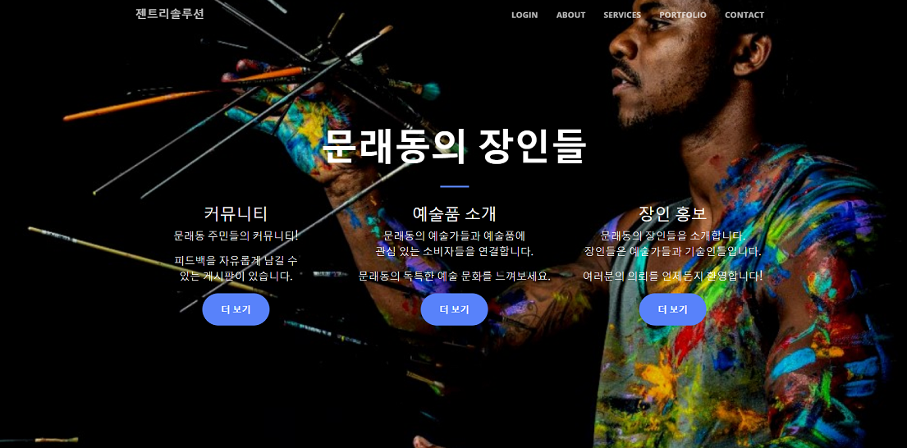

# 문래동의 장인들

 

### 1. 프로젝트 소개

**'제 4회 서강대학교 해커톤 경진대회 : 어반테크, 도시 문제의 탐색과 해결'** 출품을 위해 만들어졌습니다. 저는 당시 문래동의 예술가들 사이에서 심각하게 떠오르는 젠트리피케이션 문제를 해결하고 싶었고, 이를 위해서는 작품 활동으로 인한 수익 창출이 활발하게 이루어져야 한다고 생각했습니다. 그래서 '작품 의뢰 중개 플랫폼'을 기획하였고, 직접 팀원들을 모집해 무박 3일 동안 개발을 진행하였습니다.

 

### 2. 참여 인원 및 역할

- 김준형 : 기획 및 프론트 엔드
- 한진욱 : 백 엔드
- 김주훈 : 백 엔드

진욱이형과 주훈이형이 아니었다면 이 프로젝트는 완성되지 못했을 것입니다. 다시 한 번 두 사람에게 감사를 표합니다.

 

### 3. 프로젝트 확인 방법

1. public 폴더 클릭
2. index.html 파일을 크롬으로 열어주세요.

 

### 4. 마치며

당시 팀원 모두가 웹 개발이 처음인 상태였기에 사실 많이 부족한 프로젝트입니다. 하지만 프로젝트에 임하는 열정 만큼은 그 어느 순간보다도 뜨거웠던 것 같습니다. 이 점을 감안해주시어, 예쁘게 봐주시길 부탁드립니다. 감사합니다. 